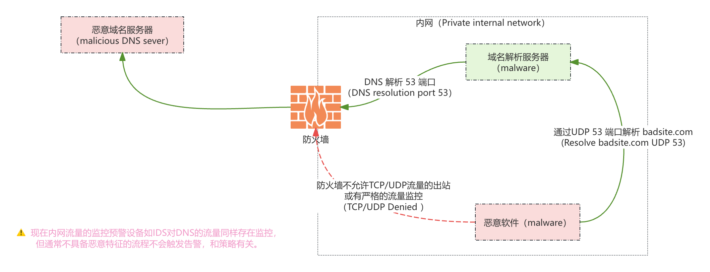

# Red Team

## 扫盲术语：

基础环境信息

```bash
# system：Ubuntu 22.04 ARM64 parallels virtual machine
# uname:Linux ubuntu-linux-22-04-desktop 5.15.0-126-generic #136-Ubuntu SMP Wed Nov 6 09:59:54 UTC 2024 aarch64 aarch64 aarch64 GNU/Linux
```

## 工具安装

> 前面还有很多内容没有写

安装手动安装powershell

```bash
apt install libunwind8
# 下载XX安装文件
# 使用dpkg命令执行安装
```

### dnscat2

该工具旨在通过DNS协议创建一个加密的命令和控制（C&C）通道，这是几乎每个网络的有效隧道，因为网站虽然限制出站浏览，但通常不会限制DNS流量。

#### dnscat2安装：

```bash
# 下载
git clone "https://github.com/iagox86/dnscat2" /opt/dnscat2
# 进入目录
cd /opt/dnscat2/client/
# 自动化编译
make
# 测试工具使用正常
./dnscat 
# 添加可全局执行的软连接
ln -s /opt/dnscat2/client/dnscat /usr/bin/dnscat
```

#### dnscat2使用：

利用DNS创建的加密隧道，几乎在每个网络中都可以使用。<span style="color:yellow">dnscat2 分为`客户端`和`服务端`两部分。</span>

**dnscant2优点：**

- 不需要root权限就允许shell访问和传输数据

- DNS的C2连接，通常不会像直接使用tcp或udp那样受到限制。

**被利用点：** 受保护的网络可能包含一个DNS服务器来解析内部主机，同时允许解析外部资源。

**利用方式：** 通过我们拥有的恶意域名设置一个权威服务器，利用DNS解析对恶意软件进行命令执行和控制。



```bash
# 
```

<span style="color:blue">@感谢：</span>:kiss:

参考项目：

https://github.com/Snowming04/The-Hacker-Playbook-3-Translation
