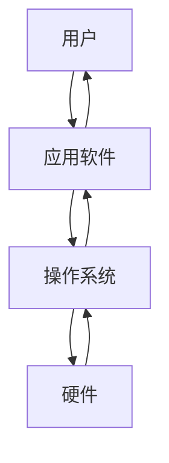
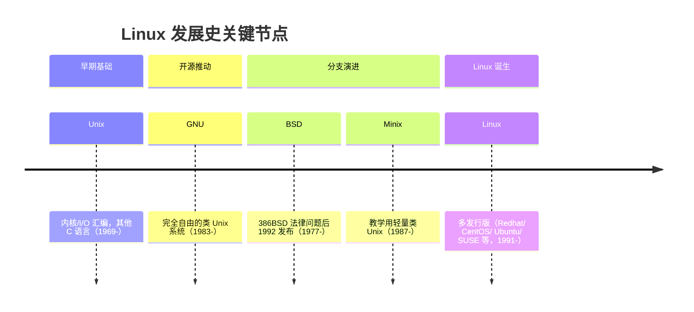

# Linux
## 1.1 **Linux系统简介**
    - Linux也是众多操作系统之一，要理解Linux，首先得要理解操作系统。
**计算机的基本工作原理**
    - 计算机是一台机器，它按照用户的要求接收信息、存储数据、处理数据，然后再将处理结果输出（文字、图片、音频、视频等）。计算机由硬件和软件组成：
        - **硬件**：计算机赖以工作的实体，包括显示器、键盘、鼠标、硬盘、CPU、主板等。
        - **软件**：按照用户的要求协调整台计算机的工作，比如Windows、Linux、Mac OS、Android等操作系统，以及Office、QQ、迅雷、微信等应用程序。
- **定义**：操作系统（Operating System，OS）是软件的一部分，是硬件基础上的**第一层软件**，作为**硬件与其他软件沟通的桥梁**（或称为“接口”“中间人”“中介”等）。
- **功能**：
    - 控制其他程序运行，管理系统资源；
    - 提供最基本的计算功能（如内存管理/配置、资源供需优先级调度等）；
    - 提供基础服务程序（如文件系统、设备驱动、用户界面、系统服务等）。

- 操作系统使得应用程序无法直接与硬件打交道必须经由操作系统的内核，协调多个程序运行避免恶意程序破坏其他进程独占资源，保证了多任务平稳的运行。
- 操作系统向外提供系统调用（API），然后系统调用被封装成库向外提供库调用，程序员只需要根据库的API接口进行编程，不用关心底层硬件的不同，便于程序的移植。
### 什么是Linux?
Linux在设计之初，是一个基于POSIX的多用户、多任务并且支持多线程和多CPU的操作系统，它是由世界各地成千上万的程序员设计和开发实现的。当初开发Linux系统的目的就是建立不受任何商业化软件版权制约的、全世界都能自由使用的类Unix操作系统兼容产品。
### 什么是Unix?
Unix是一种计算机操作系统，具有多任务、多用户的特征。IBM公司的---AIX系统、HP公司---HP-UX系统、SUN公司---Solaris系统。

在当今社会，Linux 系统主要被应用于服务器端。
我们熟知的大型、超大型互联网企业（百度、腾讯、Sina、阿里等）都在使用 Linux 系统作为其服务器端的程序运行平台，全球及国内排名前 1000 的 90% 以上的网站使用的主流系统都是 Linux 系统。因为：
- Linux 不仅是免费的，更是开源的，所以今天有非常强大的 Linux 生态；
- Linux 与 Unix 系统兼容，具备 Unix 几乎所有的优秀特性；
- Linux 让开展各种实际有用且具有创造性的事情成为可能；
- Linux 提供了复杂的软件包管理系统，可以放心地安装和维护每一个在线资源库中的软件应用。


### linux的主要特点
**设计思想**​
- **一切皆文件**：将系统资源（如硬件、进程、数据等）抽象为“文件”进行管理，简化资源操作逻辑。
- **软件功能专一**：每个软件（工具/程序）有**特定用途**，通过“组合工具”完成复杂任务（模块化设计）。
**授权与开源**​
- **完全免费**：用户可免费获取，且**可任意修改源代码**（开源特性，支持自定义开发）。
**系统兼容性**​
- **兼容POSIX 1.0标准**：提供**可移植操作系统接口**，程序可在其他兼容POSIX标准的系统上运行（跨系统兼容性）。
**用户与任务管理**
- **多用户、多任务**：
    - 多用户：不同用户对自身文件有独立权限（资源隔离与权限管理）。
    - 多任务：多个程序可**同时且独立运行**（高效利用系统资源）。
**界面特性**​
- **良好的人机界面**：同时支持**字符界面**（如终端命令行）和**图形界面**（如GNOME、KDE），满足不同使用习惯。
**硬件支持**
- **支持多种平台**：可运行在`x86`、`680x0`、`SPARC`、`Alpha`等多种硬件平台的处理器上（硬件兼容性强）。
### 发行版本
预先整合好的Linux操作系统，一般使用者不需要重新编译，直接安装后进行小幅度更改设定就可以使用。
- Redhat - 最著名的Linux版本，企业级；
- CentOS - 要求高稳定性服务器使用；
- Ubuntu - 以桌面应用为主，多媒体；
- SUSE - 连接数据库最稳定；

### 安装准备：
- Centos 7​下载地址：http://isoredirect.centos.org/centos/7/isos/x86_64/CentOS-7-x86_64-DVD-1708.iso
- VMware workstation 15​ 一款桌面虚拟计算机软件，提供用户可同时运行不同的操作系统
## 1.2 命令行基础
### 默认界面：
- Centos 7安装之后, 操作系统默认会进行入图形界面
- 输入安装时的账号密码, 进入图形界面
- 我们可以按Ctrl+Alt+F2切换到命令行
- 我们可以按Ctrl+Alt+F1切换回图形界面
- 我们为了更好学习Linux, 所以希望熟练使用命令行
- linux切换命令行登陆，输入密码时，屏幕时没有回显
### 命令提示符：
```text
Linux命令行结尾的提示符有 # 和 $ 两种不同的符号
$号是使用普通用户登录后的提示符
# 号是使用超级用户root登录后的提示符
```
### 命令行快捷键：
- **Ctrl + C**：终止当前的输入，如你在命令行中输入大量内容后，发现输入有误，或要执行其它任务。按下Ctrl + C后，会自动终止当前输入，跳转到下一行
### 命令行快捷键
- **Ctrl+A**：使光标移到最前
- **Ctrl+E**：使光标移动最后
- **Ctrl+D**：退出当前终端
- **Ctrl+L**：清除当前屏幕
- **Ctrl+Z**：暂停当前进程，与Ctrl+C不同的是Ctrl+Z暂停后可以恢复进程
### 通过网络等了Linux
- 网络登陆的首要条件是知道linux的服务器地址
- 通过 ifconfig查看接口状态，默认自动获取ip，默认网口是ens33
- centos7默认允许ssh登陆，可以通过 `ss -lnt` 查看当前开放的tcp端口，其中包含22端口即允许ssh登陆
### linux命令语法
- `命令 <选项1> <选项2> 参数`，如： `ls -l root`
- 有时候命令会带有一个或多个参数
- 通常选项有单个字母构成，并在字母前加一个链接符`-`
- 有时候选项太多，可以使用更简便的写法，如：`ls -l -a -t` 可以写成 `ls -lat`
- 有时候选项可以是一个连续的单词，称长选项，使用两个链接符加一个完整的单词，如`ls --help`
- `--help`是多数命令的帮助选项，可以查看名的基本使用方法
- 多数命令在选项之后可以接参数，参数通常是指文件名、目录、用户、设备；可以理解为命令要执行或操作的对象
- 总结：选项告诉命令怎么执行，参数告诉命令对着执行
### linux历史执行记录
- shell history 是一个记录以前所输入的命令的列表
- 通过`history`可以查看以前执行过的命令
- `! 数字` 执行history中指定编号的命令
- `!!`执行上一条命令
- `!?is?`执行history中包含is的命令
- 也可以通过箭头 上下来选择历史命令
## 1.3 文件系统和目录
### 目录结构
- 在linux系统任何东西都可以简化为文件
-  比如分区时对应 `/dev/sda1`,硬件对应`/dev/cdrom`
- `ls /` 显示根目录下的文件
```bash
root@ubuntu24:~# ls /
bin                boot   dev  home  lib.usr-is-merged  media  opt      proc  run   sbin.usr-is-merged  srv  tmp  var
bin.usr-is-merged  cdrom  etc  lib   lost+found         mnt    pentest  root  sbin  snap                sys  usr
```
- `/` 是linux所有目录的开始，是所有目录的根
```bash
root@ubuntu24:~# tree -L 1 -d /
/
├── bin -> usr/bin
├── bin.usr-is-merged
├── boot
├── cdrom
├── dev
├── etc
├── home
├── lib -> usr/lib
├── lib.usr-is-merged
├── lost+found
├── media
├── mnt
├── opt
├── pentest
├── proc
├── root
├── run
├── sbin -> usr/sbin
├── sbin.usr-is-merged
├── snap
├── srv
├── sys
├── tmp
├── usr
└── var
```
系统启动必须
- `/boot` 存放启动linux使用的内核文件，包括链接文件及镜像文件
-  `/etc`存放系统需要的配置文件和子目录列表，更改目录下的文件会导致系统不能启动
-  `/lib`存放基本代码库，如C++库，其作用类似于window中的dll文件，几乎所有的应用程序都需要用到这些共享库。
-  `/sys`


